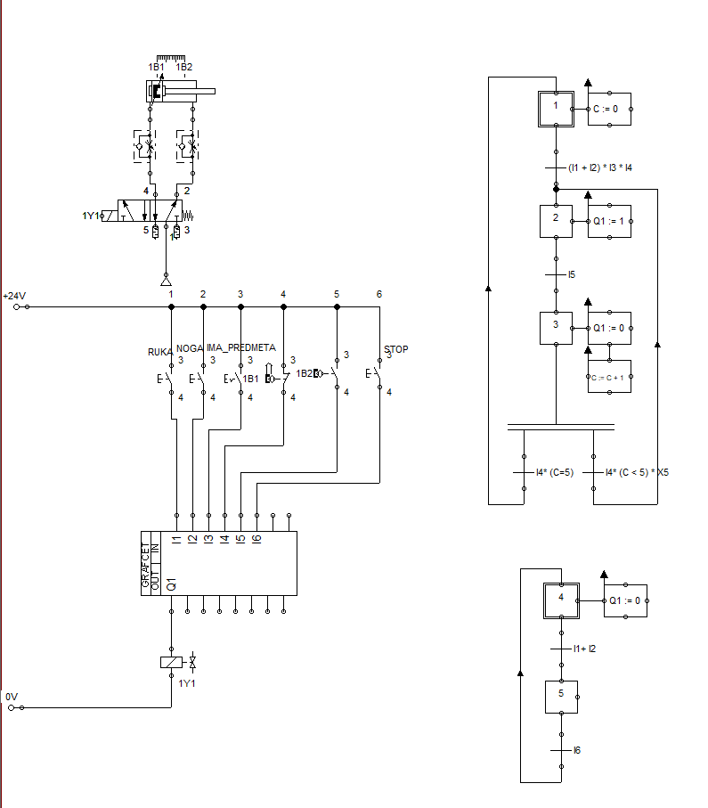
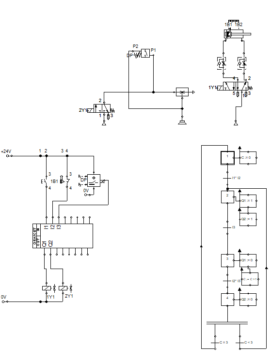
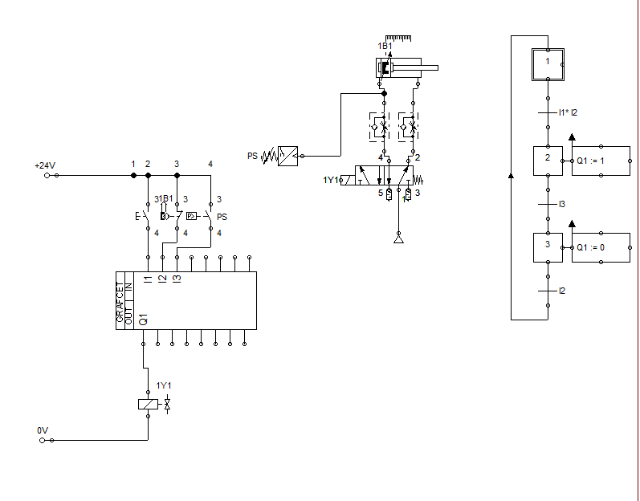
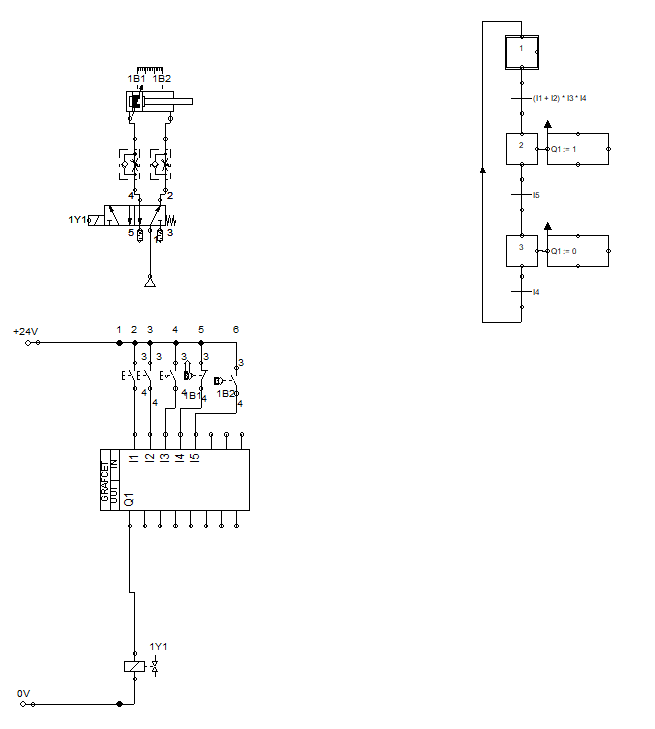
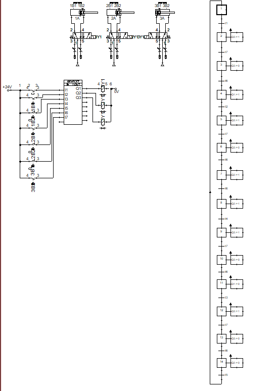

# HiP — Hydraulics & Pneumatics Simulations

All circuits are built and simulated in **FluidSim** (`.ct` files), covering a wide range of control techniques — from basic directional control to advanced GRAFCET-based sequential logic.

---

## Tools Used

- **FluidSim** — pneumatic and hydraulic circuit simulation
- **GRAFCET** — sequential function chart control logic

---

## Repository Structure

```
HiP/
├── Assignments/
│   ├── FBD/                 # Function Block Diagram assignments
│   └── GRAFCET/             # GRAFCET sequential control assignments
├── Hydraulics/              # Hydraulic circuit simulations
└── Pneumatics/              # Pneumatic circuit simulations
    ├── Monostable/          # Monostable valve control circuits
    └── Bistable/            # Bistable valve control circuits
```

---

## Topics Covered

**Pneumatics**
- Direct and indirect control of single and double-acting cylinders
- Monostable and bistable valve configurations
- Logic functions: AND, OR, combined logic
- Time-dependent, path-dependent and pressure-dependent control
- Vacuum-dependent control (mechanical and electrical)
- Cascade method and GRAFCET sequential control
- Pneumatic counters and digital technology integration
- Synchronized motion (drilling machine, stamping machine)
- Quick exhaust valve, speed control, limit switches

**Hydraulics**
- Cylinder position locking and counterhold circuits
- Differential control and speed regulation (meter-in, meter-out)
- Hydraulic cylinder synchronization (mechanical and flow divider)
- Pressure-dependent control and sequential pressure valves
- Accumulator circuits and shutoff valves
- Force-dependent control

**Electropneumatics**
- Counter integration with digital control logic
- Manual/Auto switching circuits
- Multi-cylinder coordinated motion sequences

---

## Circuit Examples

> Selected screenshots from FluidSim simulations

| Circuit | Description |
|---|---|
|  | **Vacuum Control — Electric/Digital** — electropneumatic vacuum gripper with digital logic |
|  | **Logic Functions + Counter + Time Control** — combined logic with pneumatic counter and timer |
|  | **Drilling Machine — Synchronized Motion** — two-cylinder coordinated sequence |
|  | **Counter — Digital Technology** — GRAFCET with counter logic and LOGO! implementation |
|  | **Time Control — Digital Technology** — timer-based sequential control |
|  | **Stamping Machine — Synchronized Motion** — multi-step synchronized press sequence |
|  | **Pressure Control — Digital Technology** — pressure sensor input with digital control |
|  | **Logic Functions — Digital Technology** — AND/OR logic with GRAFCET integration |
|  | **Drilling Machine** — pneumatic drill press circuit with sequential cylinder control |
|  | **Matrix Sort (3×3 & 4×2)** — multi-cylinder matrix sorting sequences with two layout configurations |

---

## Author

**Matej Kardum**
GitHub: [github.com/MatkoKardum](https://github.com/MatkoKardum)
