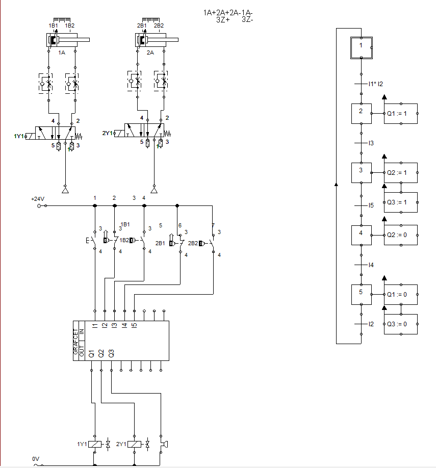
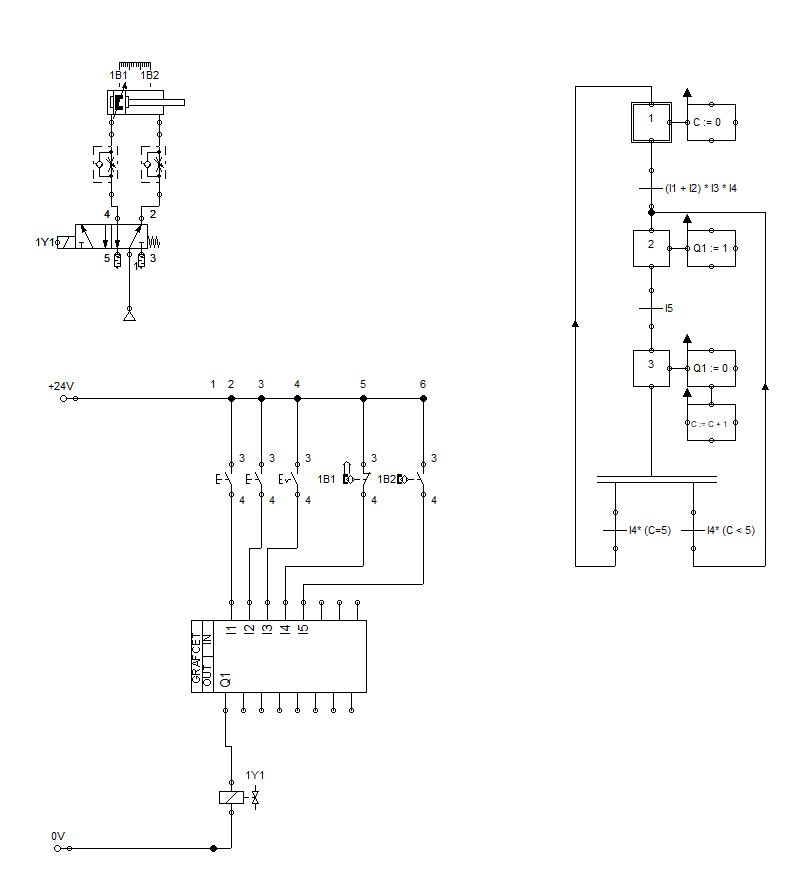
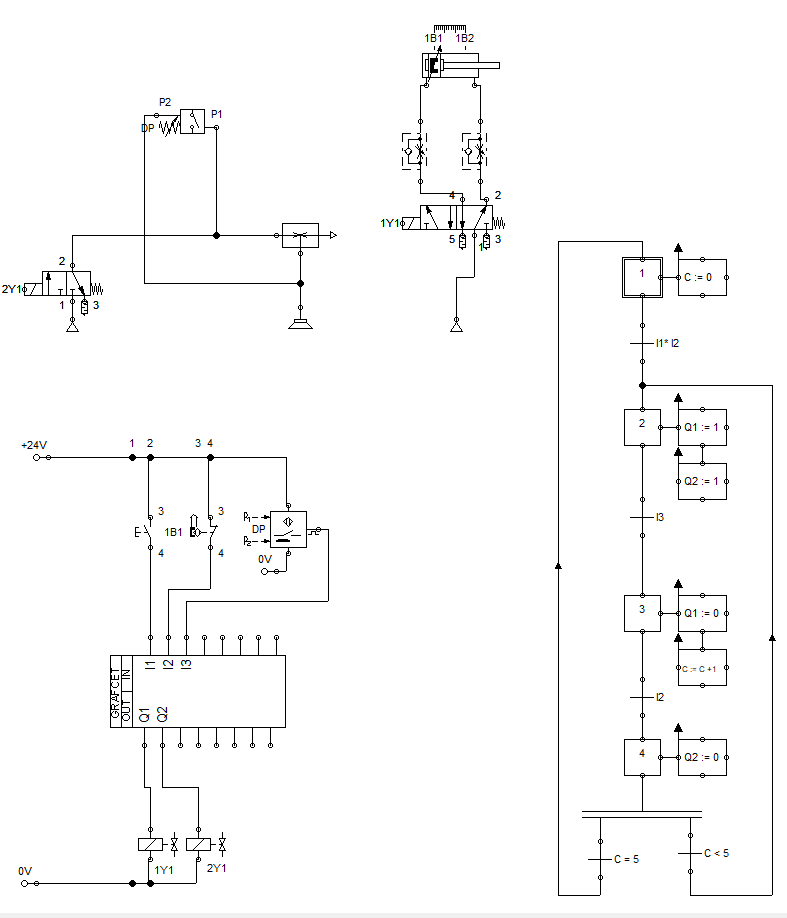
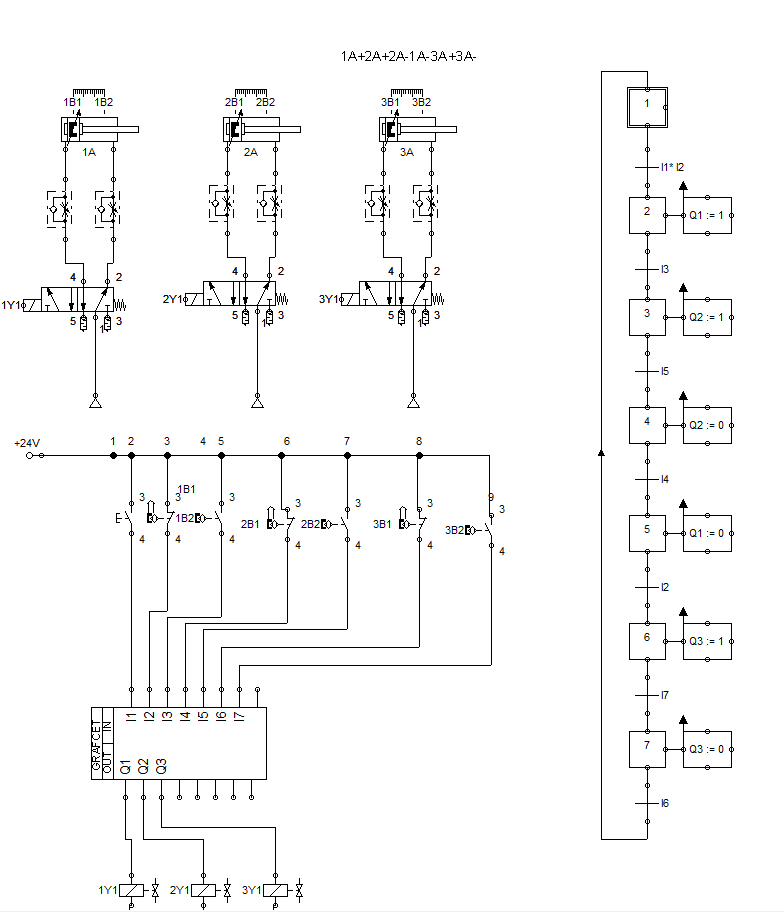
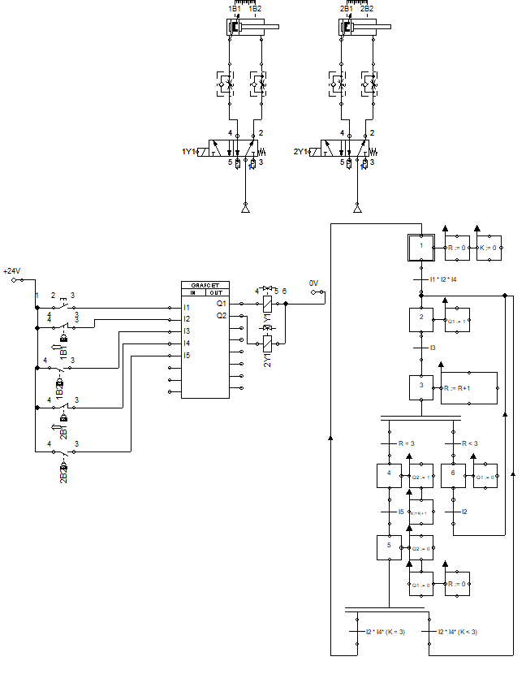

# HiP — Hydraulics & Pneumatics Simulations

A collection of hydraulic and pneumatic circuit simulations developed during secondary school (Elektrotehnička srednja škola Tuzla, 2020–2024) as part of the Mechatronics Technician program, under the mentorship of professor Salih.

All circuits are built and simulated in **FluidSim** (`.ct` files) and **LOGO! Soft Comfort** (`.lsc` files), covering a wide range of control techniques — from basic directional control to advanced GRAFCET-based sequential logic.

---

## Tools Used

- **FluidSim** — pneumatic and hydraulic circuit simulation
- **LOGO! Soft Comfort** — PLC ladder logic (Siemens LOGO!)
- **GRAFCET** — sequential function chart control logic

---

## Repository Structure

```
HiP/
├── Classroom zadace/       # Classroom exercises — pneumatics & hydraulics
├── Dodatna nastava/        # Additional training & competition prep (2023)
│   └── GRAFCET/            # GRAFCET-based control diagrams
├── Hidraulika/             # Hydraulic circuit simulations
│   └── pdf/                # Hydraulics reference materials
└── Pneumatika/             # Pneumatic circuit simulations
    ├── Bistabil/            # Bistable valve control circuits
    ├── Monostabil/          # Monostable valve control circuits
    └── Elektropneumatika/  # Electropneumatic control circuits
```

---

## Topics Covered

**Pneumatics**
- Direct and indirect control of single and double-acting cylinders
- Monostable and bistable valve configurations
- Logic functions: AND, OR, combined logic
- Time-dependent, path-dependent and pressure-dependent control
- Vacuum-dependent control (mechanical and electrical)
- Cascade method and GRAFCET sequential control
- Pneumatic counters and digital technology integration
- Synchronized motion (drilling machine, stamping machine)
- Quick exhaust valve, speed control, limit switches

**Hydraulics**
- Cylinder position locking and counterhold circuits
- Differential control and speed regulation (meter-in, meter-out)
- Hydraulic cylinder synchronization (mechanical and flow divider)
- Pressure-dependent control and sequential pressure valves
- Accumulator circuits and shutoff valves
- Force-dependent control

**Electropneumatics & PLC (LOGO!)**
- GRAFCET-to-LOGO! implementation
- Counter integration with digital control logic
- Manual/Auto switching circuits
- Multi-cylinder coordinated motion sequences

---

## Circuit Examples

> Selected screenshots from FluidSim simulations

| Circuit | Description |
|---|---|
|  | **Vacuum Control — Electric/Digital** — electropneumatic vacuum gripper with digital logic |
|  | **Logic Functions + Counter + Time Control** — combined logic with pneumatic counter and timer |
|  | **Drilling Machine — Synchronized Motion** — two-cylinder coordinated sequence |
|  | **Counter — Digital Technology** — GRAFCET with counter logic and LOGO! implementation |
|  | **Time Control — Digital Technology** — timer-based sequential control with LOGO! |
|  | **Stamping Machine — Synchronized Motion** — multi-step synchronized press sequence |
|  | **Pressure Control — Digital Technology** — pressure sensor input with digital control |
|  | **Logic Functions — Digital Technology** — AND/OR logic with GRAFCET integration |
|  | **Drilling Machine** — pneumatic drill press circuit with sequential cylinder control |
|  | **Matrix Sort (3×3 & 4×2)** — multi-cylinder matrix sorting sequences with two layout configurations |
---

## Notable Projects

**Competition Task — Mechatronics Technician**
Circuits developed as preparation for the national competition in mechatronics production, which resulted in winning the **National Championship of Bosnia and Herzegovina** two years in a row (2023, 2024).

Files: `Dodatna nastava/2023/ZADATAK_TAKMICENJE.ct` and `ZADATAK_TAKMICENJE_PLC.ct`

---

## Author

**Matej Kardum**
Electrical Engineering student — Faculty of Electrical Engineering Sarajevo (Robotics & Automation)
GitHub: [github.com/MatkoKardum](https://github.com/MatkoKardum)
